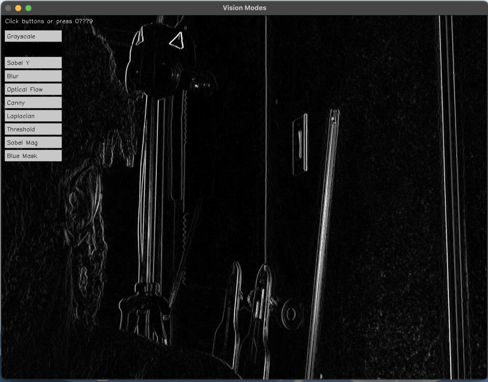
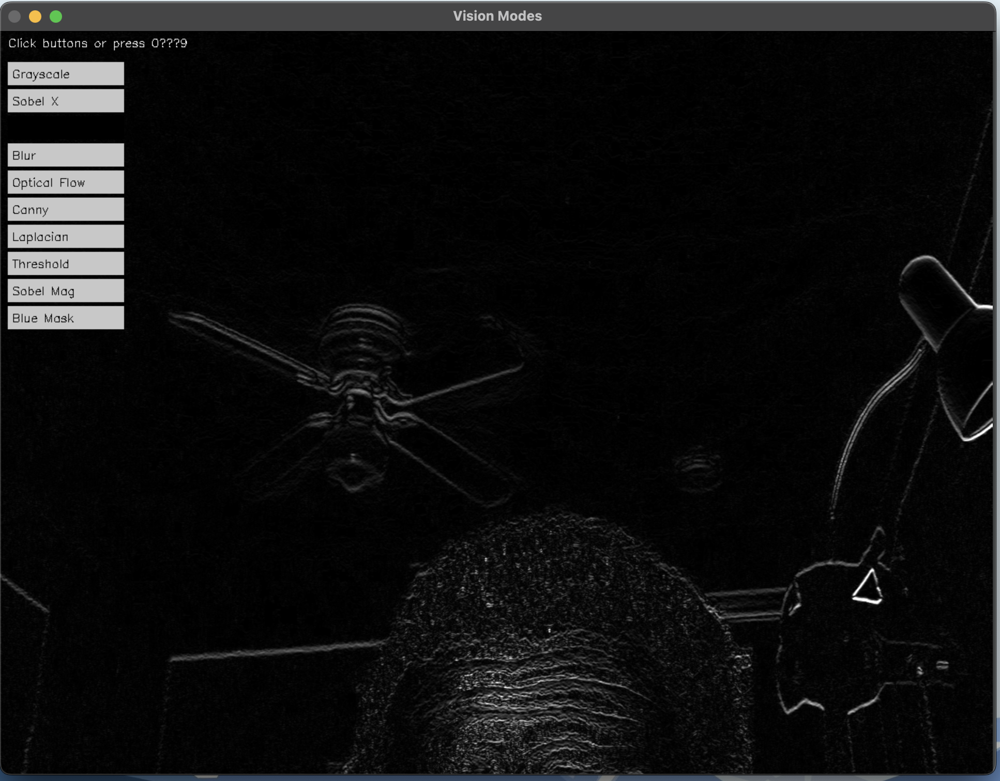
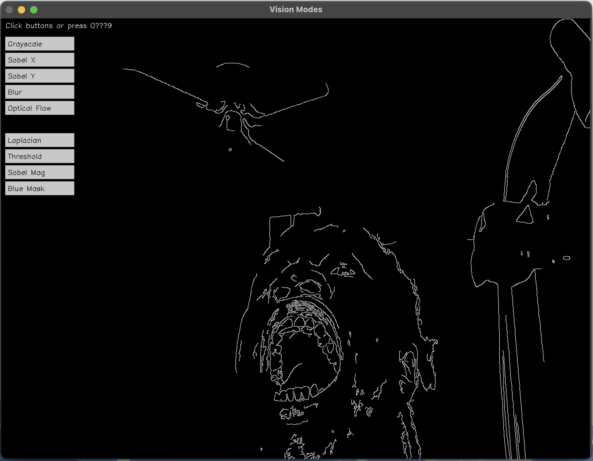

# Vision Modes App

An interactive C++ application built with OpenCV that visualizes a variety of classic computer vision techniques in real time. The app features a simple button-based UI for toggling between visual modes like edge detection, thresholding, blur, and optical flow.

---

## 🎯 Features

- Real-time frame processing
- Toggle modes via UI buttons or keyboard input
- Displays the following modes:
  - Grayscale
  - Sobel X
  - Sobel Y
  - Sobel Magnitude
  - Laplacian
  - Threshold
  - Blur
  - Blue Channel Mask
  - Dense Optical Flow

---

## 🖼️ Sample Outputs

| Mode        | Screenshot |
|-------------|------------|
| Sobel X     |  |
| Sobel Y     |  |
| Canny (Captured) |  |

> All screenshots are saved from within the app using the current frame view.

---

## 🛠️ Requirements

- C++17
- OpenCV 4.x (installed via Homebrew)
- CMake 3.15+
- macOS (tested on Apple Silicon)

---

## ⚙️ Build Instructions

```bash
# From project root
export PKG_CONFIG_PATH="/opt/homebrew/lib/pkgconfig"

cmake -B build
cmake --build build
./vision_modes
